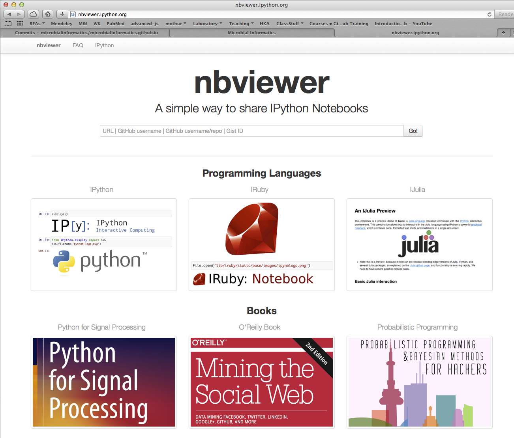
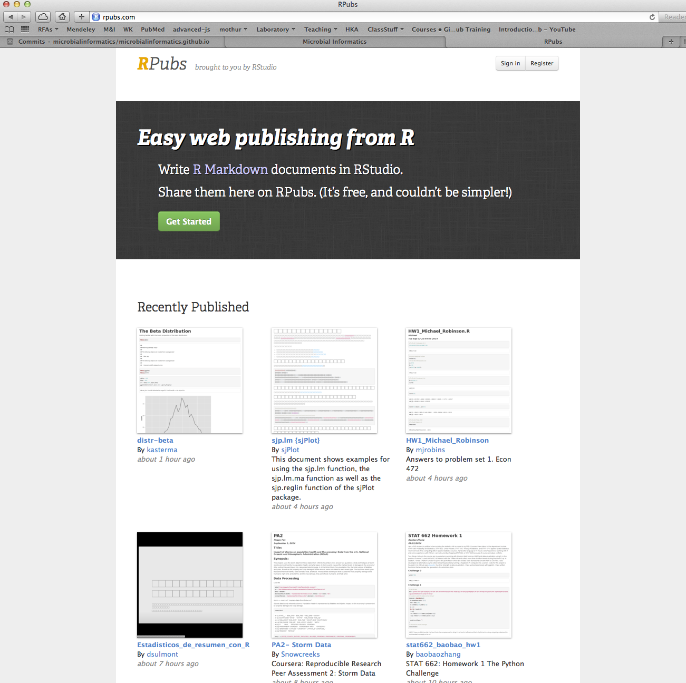
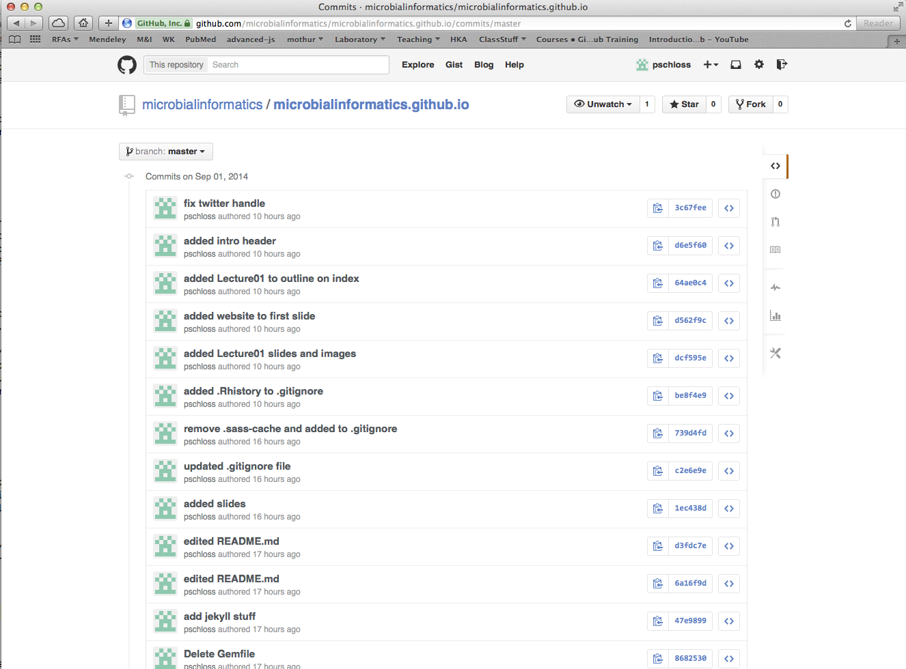
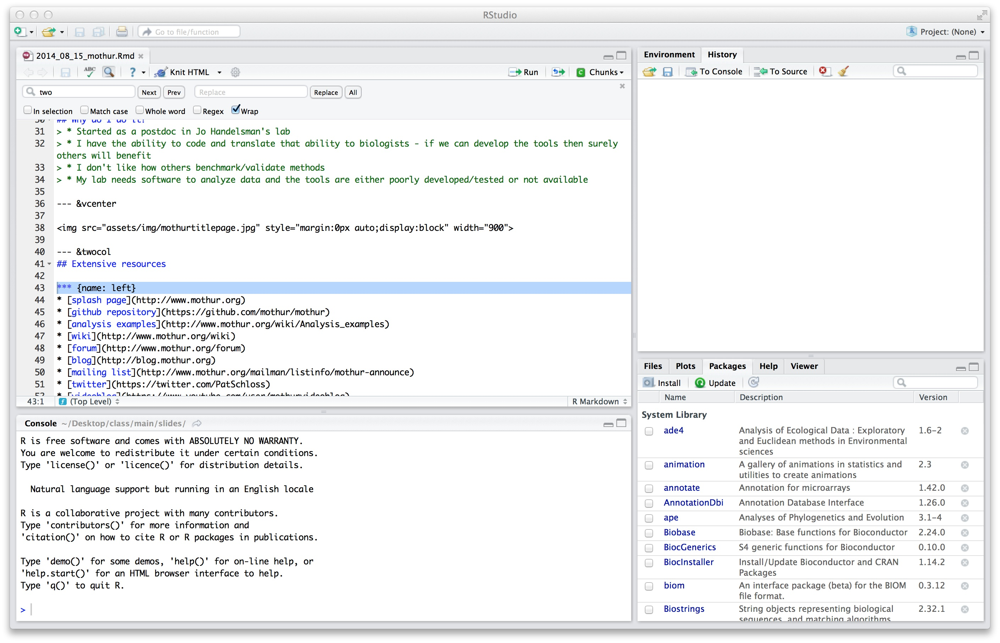

--- 
title       : Microbial Informatics
subtitle    : Lecture 01
date        : September 2, 2014
author      : Patrick D. Schloss, PhD (microbialinformatics.github.io)
job         : Department of Microbiology & Immunology
framework   : io2012        # {io2012, html5slides, shower, dzslides, ...}
highlighter : highlight.js  # {highlight.js, prettify, highlight}
hitheme     : tomorrow      # 
widgets     : []            # {mathjax, quiz, bootstrap}
mode        : standalone    # {selfcontained, standalone, draft}
knit        : slidify::knit2slides

--- 

## Learning objectives
* Understand the concepts of reproducible research
* Learn what's wrong with how we currently do data analysis
* Gain exposure to tools that will help us to do reproducible research

--- 
## Introduction
* Need for...
 * electron/paper trail
 * programming
 * statistics
	
* Datasets are not getting any smaller
* Great demand for numeracy skills

---

## Objectives for semester
* Develop skills that will foster more reproducible data analysis
* Learn to adopt the appropriate statistical test for different applications
* Create scripts that will perform custom data analysis in a reproducible manner

---

## Reproducible data analysis

> * "ultimate product of academic research is the paper along with the full computational environment used to produce the results in the paper such as the code, data, etc. that can be used to reproduce the results and create new work based on the research" - [Wikipedia](http://en.wikipedia.org/wiki/Reproducibility#Reproducible_research)
> * Notable problems (see [Nature special issue](http://www.nature.com/nature/focus/reproducibility/))  
 * Inability to replicate analyses  
 * Inability to replicate experiments   
> * Not claiming any impropriety
> * Ever tried to replicate someone else's analysis?

---

## What would it take to replicate someone's analysis?
* Raw data
* Software versions
* Detailed data processing steps

---

## What would be required of you?
* Making raw data available from a centralized location
 * Laboratory server / dropbox
 * GenBank
 * FigShare
* A digital notebook
 * Executable documentation?
 * Provided from a centralized location
 * GitHub


---

## What do you currently do?
* How well could you tell me how you manipulate data in Excel or Prism?
* Click buttons without writing anything down
* Digital notebook? Pfffft.

---

## A digital notebook
* Wiki server (e.g. [mothur 16S rRNA gene sequence analysis SOPs](http://www.mothur.org/wiki/MiSeq_SOP))
* iPython notebook (e.g. [Ding & Schloss Nature article](http://nbviewer.ipython.org/gist/pschloss/9815766/notebook.ipynb))
* knitr-based notebook
 * slides and lecture notes will be provided using this format
 * homework assignments will be submitted in this format

---

## Embed source code in documents

```{r, eval=FALSE}
x <- runif(20)
y <- runif(20)
par(mar=c(5,4,0.5,0.5))
plot(x, y, xlab="Random X Value", ylab="Random Y Value", main="", col="blue", pch=19, cex=1.25)
```

---

## Embed source code in documents

```{r, echo=FALSE, fig.align="center"}
x <- runif(20)
y <- runif(20)
par(mar=c(5,4,0.5,0.5))
plot(x, y, xlab="Random X Value", ylab="Random Y Value", main="", col="blue", pch=19, cex=1.25)
```

---
## [nbviewer]()



---

## [Rpubs]()




--- &twocol
## Version control software (VCS)

*** {name: left}
* A "time machine" of versions of text and software
* Facilitates collaboration
 * In a collaborative setting you can see who changed what
 * Allows for simultaneous editing

*** {name: right}
  

--- &vcenter




---

## Objectives for semester
* Develop skills that will foster more reproducible data analysis
* Learn to adopt the appropriate statistical test for different applications
* Create scripts that will perform custom data analysis in a reproducible manner

---

## Basic problems...
* What type of plots for different types of data?
* What should the error bars represent?
* What is a P-value?
* For question X and data Y, which test should I do?
* What's the difference between a parametric and non-parametric test?
* What should my N be?

--- &twocol

## Introducing R

*** {name: left}
* Programming language that allows one to:
 * Perform any type of analysis
 * Generate attractive plots
 * Generate reproducible reports and websites
* Open-source, community supported, widely used
* RStudio provides a user-friendly front-end

*** {name: right}



---

## Objectives for semester
* Develop skills that will foster more reproducible data analysis
* Learn to adopt the appropriate statistical test for different applications
* Create scripts that will perform custom data analysis in a reproducible manner

---

## Philosophy...
* Think of this as a foreign language class.
* There's a lot of vocabulary to learn in R, but a lot of it you can create on your own.  E.g. sum command
* We will start with the basic parts of speech
* Later we will learn about sentence structure
* Programming languages have similar parts of speech and sentence structure, it's just a matter of getting the syntax right
* The hard part is getting the *thinking* right!

---

## R as a language
* Platform-independent
* High-level programming language
* Many people from sociology to molecular biology are using and developing; you can too!
* The Comprehensive R Archive Network (CRAN)

---

## Possible applications for your research
* Data processing pipeline
* Convert ODs from a plate reader to growth curve characteristics
* Primer design
* PubMed crawler
* Anything you do that is repitious

---

## Software
* [R](http://mirrors.nics.utk.edu/cran/)
* [RStudio](http://www.rstudio.com)
* git/GitHub
 * [Mac](https://mac.github.com)
 * [Windows](https://windows.github.com)
* Text editor
 * [TextWrangler (Mac)](http://www.barebones.com/products/textwrangler/)
 * [Notepad++ (Windows)](http://notepad-plus-plus.org)

---

## Books
* [Introductory statistics with R](http://www.amazon.com/Introductory-Statistics-R-Computing/dp/0387790535/ref=sr_1_1?s=books&ie=UTF8&qid=1409624120&sr=1-1&keywords=Introductory+statistics+with+R) by Peter Dalgaard [buy]
* [The Art of R Programming](http://www.amazon.com/The-Art-Programming-Statistical-Software/dp/1593273843) by Norman Matloff [buy]
* [Bioinformatics data skills](http://shop.oreilly.com/product/0636920030157.do) by Vincent Buffalo [talk to Pat]
* [ProGit](http://git-scm.com/book) by Scott Chacon [reference]

---

## Course structure
* Lectures will present theory with some hands on 
* Friday labs will focus on practical aspects
* Grading
 * **Problem sets (50%):** to be started in lab
 * **Project 1 (25%):** prepare a statistical report with graphs and analysis covering some type of statistical problem faced by your laboratory (or that interests you) (40%)
 * **Project 2 (25%):** write a program to solve a problem you or someone else face in the laboratory (or that interests you)

---

## Course schedule
* This is still a work in progress
* Some dates might get moved around a little bit
* May have subsitutes as necessary

---

## Academic integrity
* There really is no reason to reinvent the wheel. The goal is to develop practical solutions in the easiest manner possible
* A major focus of this course is on making source code open and accessible to others. This requires proper attribution
* Failure to properly attribute your colleagues or others will result in a zero for the assignment
* You're in grad school. Act like it!

---

## For Thursday
* Install appropriate software
* Order books
* Sign-up for an account on [GitHub](http://github.com)
* Check out Software Carpentry [Git tutorial](http://software-carpentry.org/v5/novice/git/index.html)

--- .segue .dark

## Questions?

