--- 
title       : Microbial Informatics
subtitle    : Lecture 02
date        : September 4, 2014
author      : Patrick D. Schloss, PhD (microbialinformatics.github.io)
job         : Department of Microbiology & Immunology
framework   : io2012        # {io2012, html5slides, shower, dzslides, ...}
highlighter : highlight.js  # {highlight.js, prettify, highlight}
hitheme     : tomorrow      # 
widgets     : []            # {mathjax, quiz, bootstrap}
mode        : standalone    # {selfcontained, standalone, draft}
knit        : slidify::knit2slides

--- 

## Learning objectives
* Gain familiarity with RStudio
* Describe how to generate a document in markdown and the R flavor of markdown
* Understand the basics of version control software using git

--- &vcenter

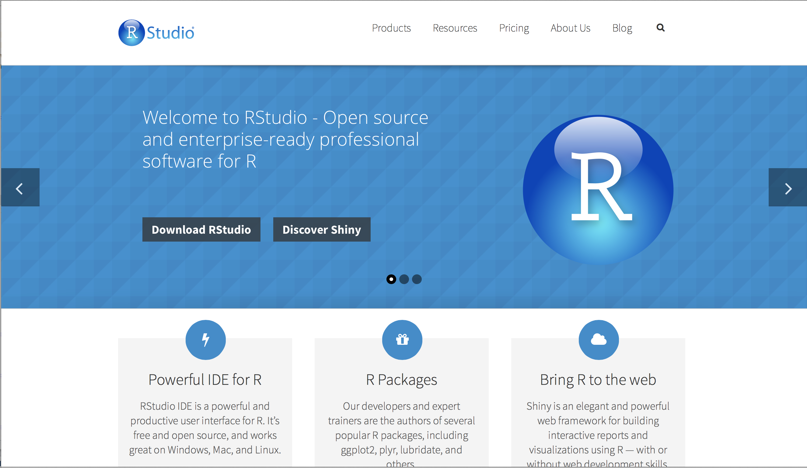

*** =pnotes
* The RStudio website has a lot of support built into it with miniature tutorials, videos, etc

--- &vcenter

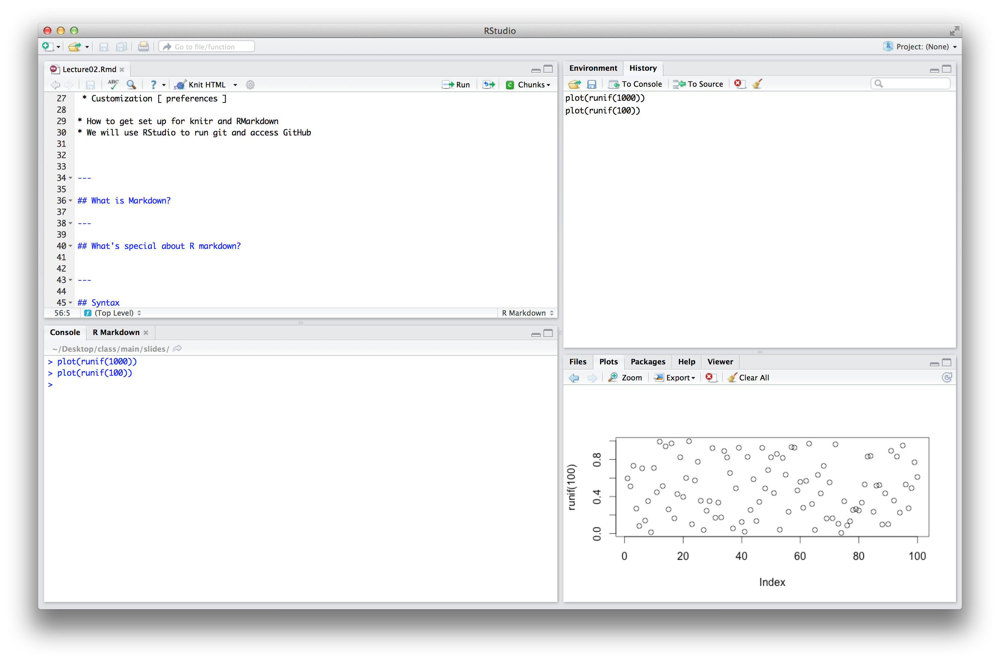

*** =pnotes

* This is what's called an IDE: integrated development environment
* It is important to note that you don't need RStudio to run R. I frequently do everything from the command line using a text editor
* The main window is made up of four panes: source code (up left), console (bot left), history/environment (up right), and display (bot right)
* There are a variety of widgets on the screen that you can explore throughout the semester

--- &vcenter

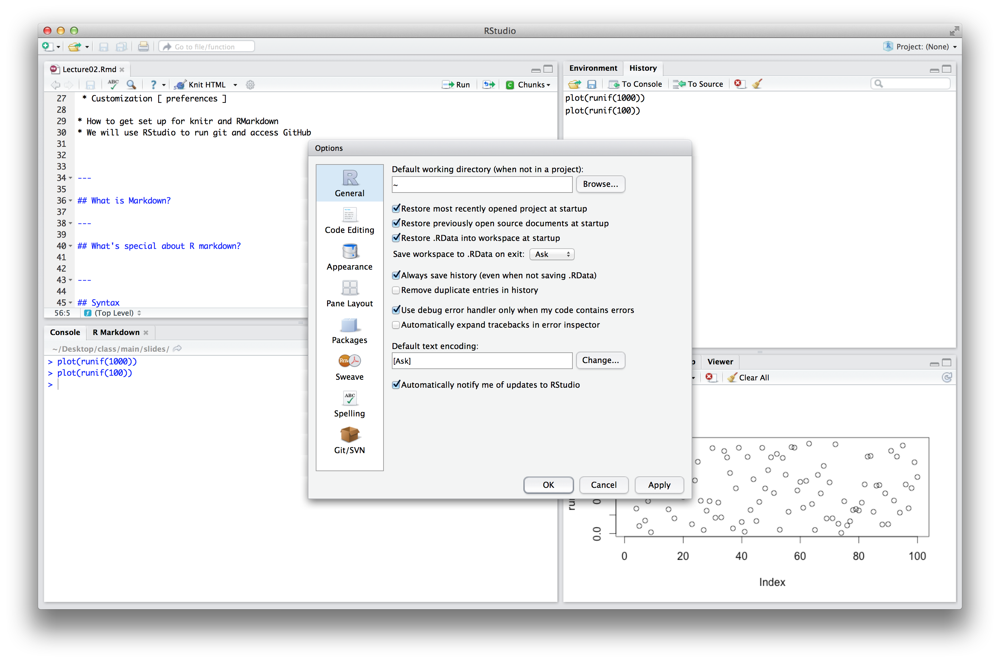

*** =pnotes
* There are many settings you can change in the preferences pane
* Here are the general prefs - let's leave the defaults
* Again, feel free to tweak as we go -> find what works best for you

--- &vcenter

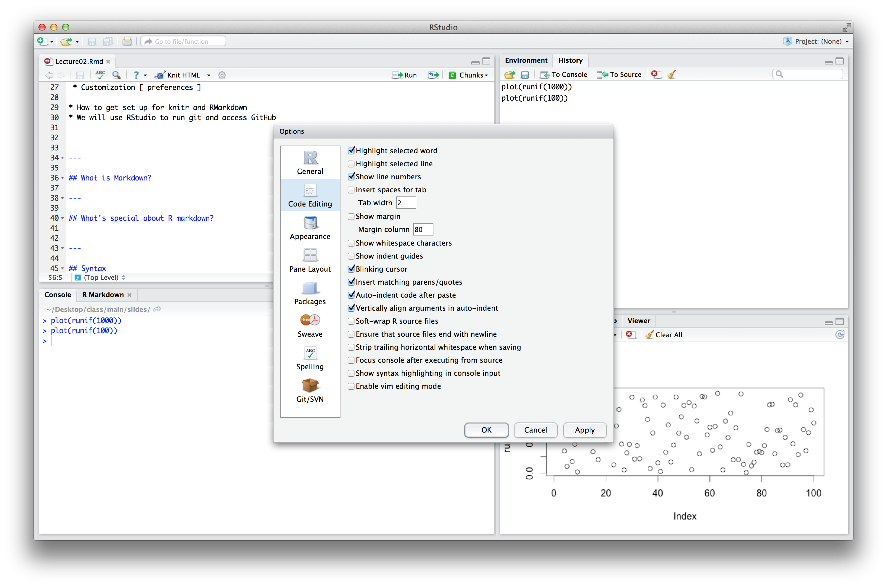

*** =pnotes
* Here are a number of check boxes for various options
* Things like line numbers, auto indenting, etc. are very useful
* Again, feel free to tweak as we go -> find what works best for you

--- &vcenter

*** =pnotes
* Here you can change how things appear, font, size, etc.
* You can also play around with the color scheme some
* Try clicking different editor theme options to see how things change

--- &vcenter

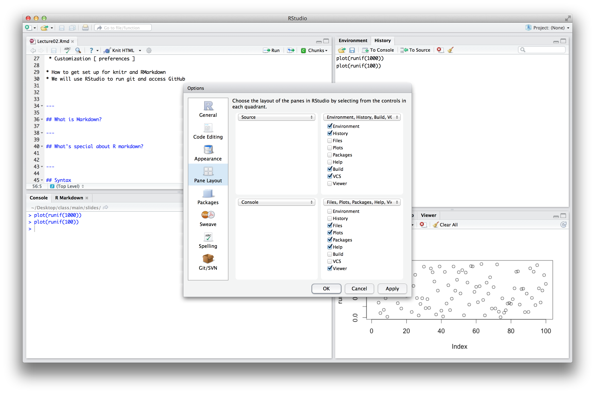

*** =pnotes
* Here you can set the pane layout to move things around as you like

--- &vcenter

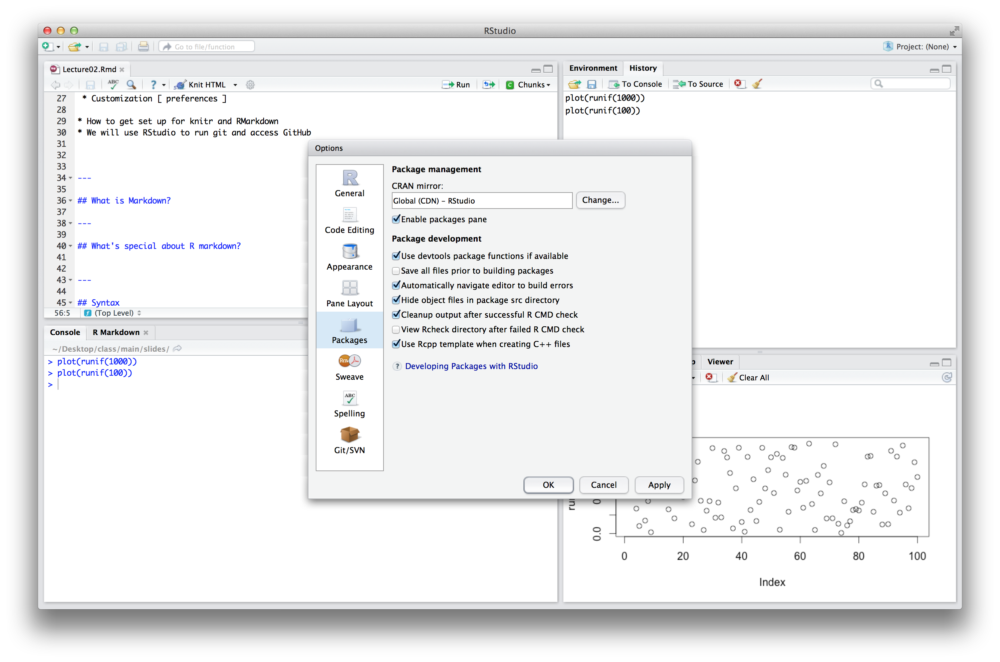

*** =pnotes
* Here you set preferences about how packages are installed. Don't worry about it too much

--- &vcenter

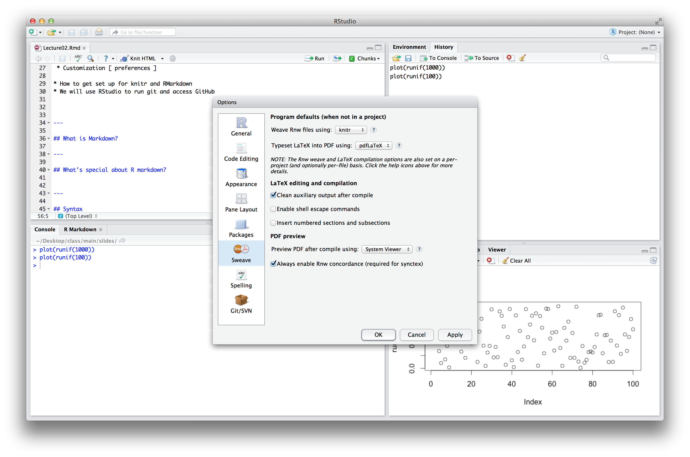

*** =pnotes
* Sweave was the predecessor to knitr - we want to use knitr
* Set the "Weave Rnw files using" option to knitr
* May need to go to the package pane to select and install knitr 

--- &vcenter

*** =pnotes
* Spelling, meh.

--- &vcenter

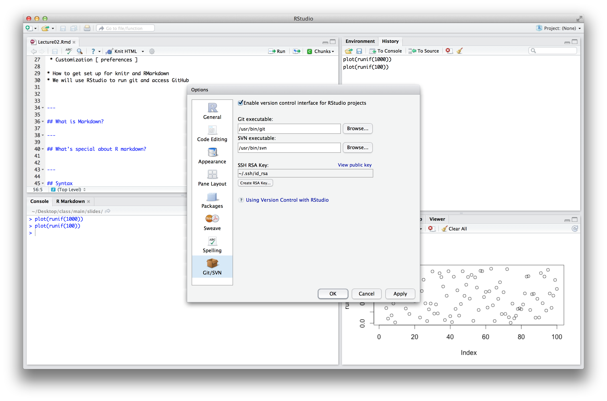

*** =pnotes
* As we mentioned R will play nicely with git and github. We'll talk about the details of this later
* For now make sure the box is checked

---

## What is Markdown (*.md)?
* "Markdown is a text-to-HTML conversion tool for web writers. Markdown allows you to write using an easy-to-read, easy-to-write plain text format, then convert it to structurally valid XHTML (or HTML)." - [John Gruber](http://daringfireball.net/projects/markdown/)
* The advantage is that you can read it as a text document and it will make sense and you can use conversion software to generate other file formats including html, pdf, docx
* Can be rendered using:
 * A Perl script from Gruber
 * RStudio

*** =pnotes
* These slides and course materials will be written in Markdown

--- 

## What's special about R markdown (*.Rmd)?
* "R Markdown is an authoring format that enables easy creation of dynamic documents, presentations, and reports from R. It combines the core syntax of markdown (an easy-to-write plain text format) with embedded R code chunks that are run so their output can be included in the final document. R Markdown documents are fully reproducible (they can be automatically regenerated whenever underlying R code or data changes)." - [RStudio website](http://rmarkdown.rstudio.com)
* Keys...
 * Ability to format text
 * Embed R code and output as chunks or inline

---

## Chunks

---  

## Inline

> * Let me pick a random number between 1 and 10.
> * Hmmm, I pick 7
> * 7 squared is 49
> * All of the numbers (after 1 and 10) were generated within R
> * The dynamic component is that you use R packages to allow a user to set the min and max values to bound your pick

---

## knitr
* The chunks and inline approaches are implemented using an R package called knitr
* We will talk about knitr later when we start digging into R's syntax
* Documentation and a book (written in knitr) can be found on [Yi Hui's website](http://yihui.name/knitr/)

---

## Syntax
* An R markdown "cheat sheet" is available for you to download and print from [rstudio.com](http://shiny.rstudio.com/articles/rm-cheatsheet.html)
* Other documentation, examples, tutorials are available at [rmarkdown.rstudio.com](http://rmarkdown.rstudio.com)
 * You can use existing [document templates](http://rmarkdown.rstudio.com/developer_document_templates.html)
 * You can design your own [report templates](http://rmarkdown.rstudio.com/developer_custom_formats.html)
 * Possible to insert [paper references](http://rmarkdown.rstudio.com/authoring_bibliographies_and_citations.html)
 * There's a lot more there
* We will be using R markdown tomorrow as part of the exercise

*** =pnotes
* Students are encouraged to go through the rmarkdown.rstudio.com on their own
* We will be using the basics of R markdown in this course, but if you want to make documents
more attractive you'll likely want to play with the formatting styles.

--- &vcenter

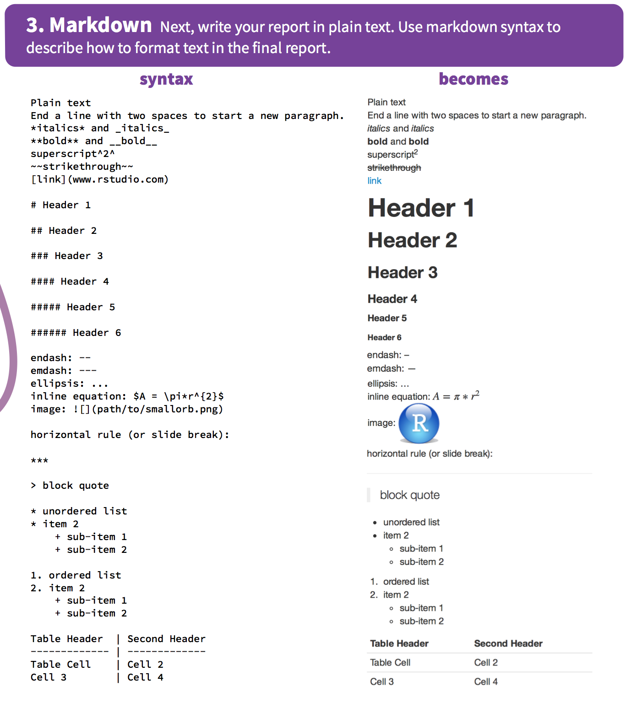

*** =pnotes
If you can learn this you'll be good to go...

--- &vcenter

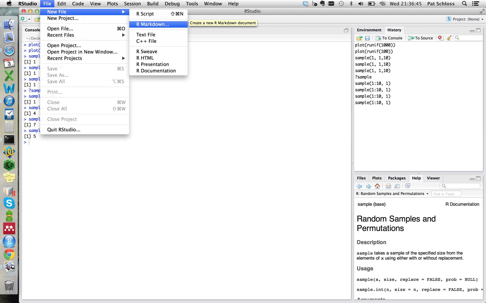

--- &vcenter

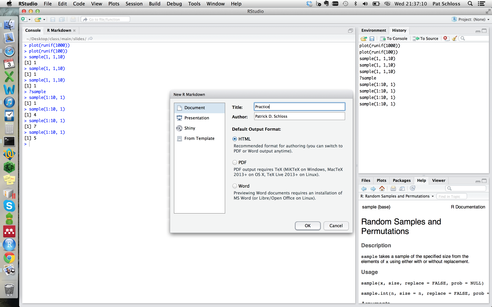

--- &vcenter

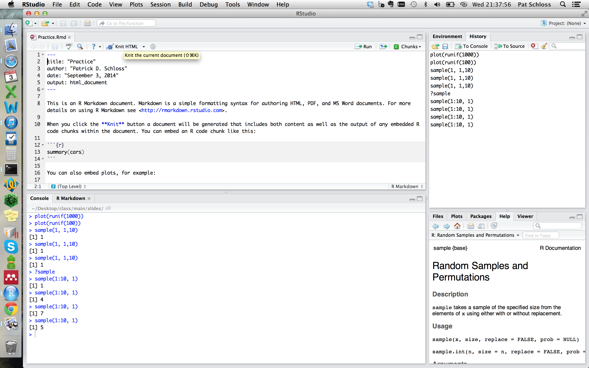

*** =pnotes
Encourage students to muck around with R Markdown syntax here

--- &vcenter

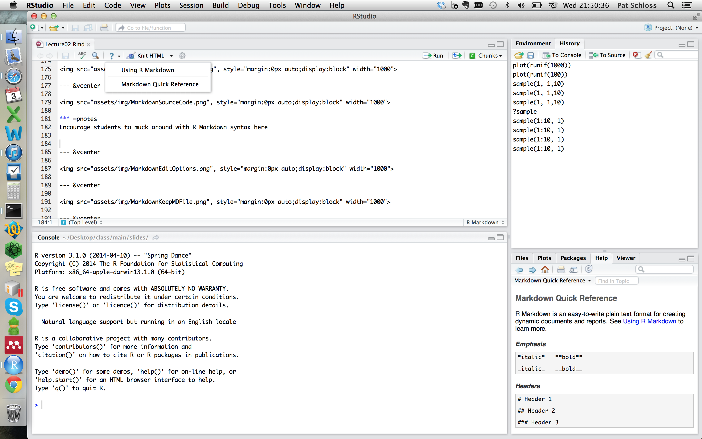

--- &vcenter

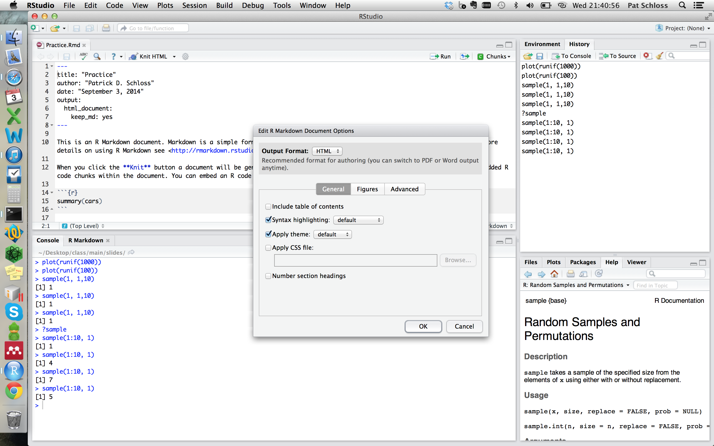

--- &vcenter

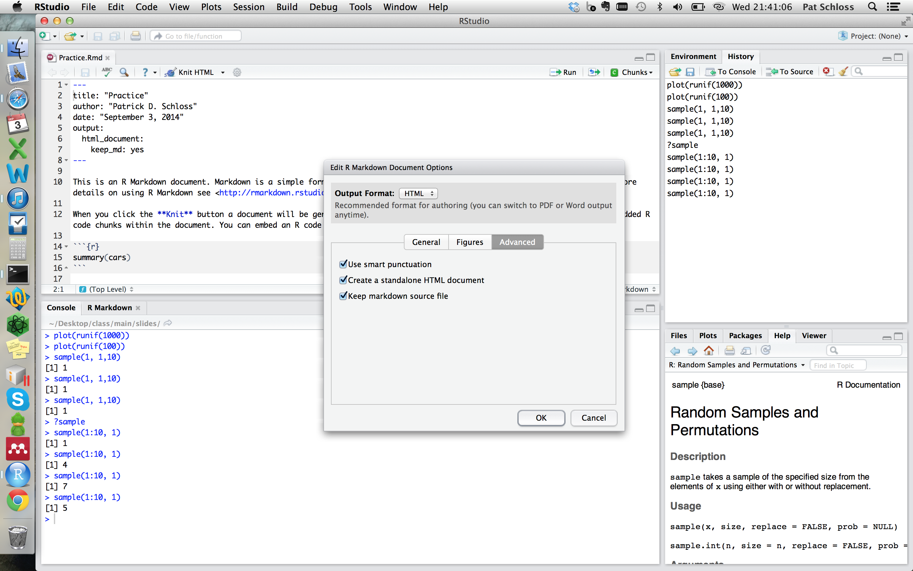

--- &vcenter

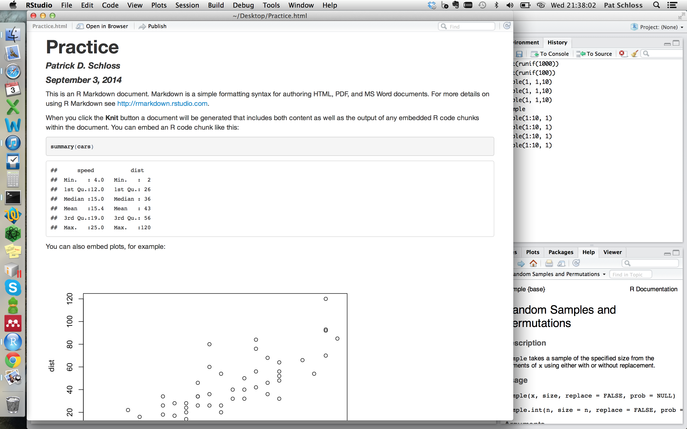

---

## Version control software (VCS)
* Example scenarios:
 * You are working by yourself on the data analysis for your thesis. Your advisor wants to see the bleeding edge code for what you are doing.
 * You are working with collaborators on the data analysis for a paper. Since each has a different piece of the story to take care of, everyone has their own workflows, versions of the raw data, etc. 
 * You discover a bug in your favorite R package and have found a fix for it
* Each of these problems can be solved using VCS

---

## Version control defined  
> "A tool for managing changes to a set of files. Each set of changes creates a new revision of the files; the version control system allows users to recover old revisions reliably, and helps manage conflicting changes made by different users."
-- [Software Carpentry Workshop](http://software-carpentry.org/v5/gloss.html#version-control)

---

## Important points
* It's virtually impossible to lose old versions of text
* Can be used like the "undo/redo" features in Word, but with branches
* Keeps a record of who made changes and when
* Difficult to ignore other people's contributions since software notifies of conflicts
* git is one type of VCS, but it's the most popular

--- &twocol

## Theory ([From ProGit] (http://git-scm.com/book/en/Getting-Started-About-Version-Control))

*** {name: left}

*** {name: right}

--- &vcenter

## Theory ([From ProGit] (http://git-scm.com/book/en/Getting-Started-Git-Basics))

*** =pnotes
Git keeps track of snapshots of your files over time and if a file hasn't changed since the last "save", the it uses a pointer to point back to the previous version

--- &vcenter

## Theory ([From ProGit] (http://git-scm.com/book/en/Getting-Started-Git-Basics))

*** =pnotes
* The working directory is a single checkout of one version of the project. These files are pulled out of the compressed database in the Git directory and placed on disk for you to use or modify.
* The staging area is a simple file, generally contained in your Git directory, that stores information about what will go into your next commit. It’s sometimes referred to as the index, but it’s becoming standard to refer to it as the staging area.
* The Git directory is where Git stores the data for your project. This is the most important part of Git, and it is what is copied when you clone a repository from another computer.

---

## Basic workflow...
* Muck around with the files in your working directory. Possibly add or delete files.
* You stage the files, adding snapshots of them to your staging area. (`git add`)
* You take the files as they are in the staging area and store that to your Git directory. (`git commit`)

---

## For Friday
* Install appropriate software that we discussed on Tuesday
* Sign-up for an account on [GitHub](http://github.com)
* Check out Software Carpentry [Git tutorial](http://software-carpentry.org/v5/novice/git/index.html)
* Read first two chapters of ProGit
 * [Getting Started](http://git-scm.com/book/en/Getting-Started)
 * [Git Basics](http://git-scm.com/book/en/Git-Basics)

--- .segue .dark

## Questions?

