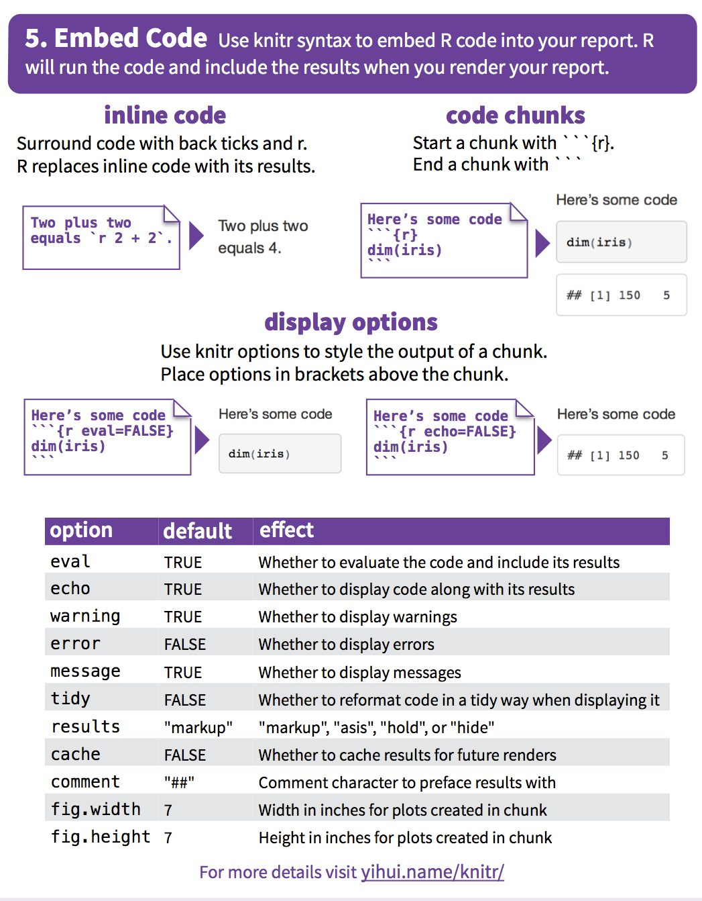
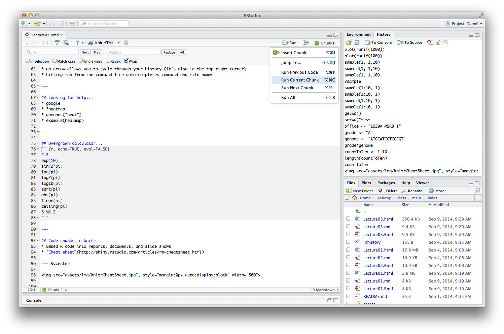
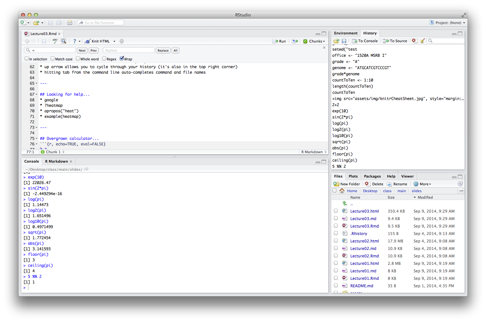

--- 
title       : Microbial Informaticsgetwd()
subtitle    : Lecture 03
date        : September 9, 2014
author      : Patrick D. Schloss, PhD (microbialinformatics.github.io)
job         : Department of Microbiology & Immunology
framework   : io2012        # {io2012, html5slides, shower, dzslides, ...}
highlighter : highlight.js  # {highlight.js, prettify, highlight}
hitheme     : tomorrow      # 
widgets     : []            # {mathjax, quiz, bootstrap}
mode        : standalone    # {selfcontained, standalone, draft}
knit        : slidify::knit2slides
--- 

## Announcements
* No class on Thursday. We will use first hour of Friday's lab to cover Thursday's material and then I will turn you loose to work on the lab material.
* Some of you have gotten comments back from me already about your "Pull Requests". Responding to these will enable you to get a better grade if you can satisfy what I comment on.
* Note that problems 2 and 3 need to be submitted as pull requests to different repositories as indicated in the assignment materials
* My office is 1520A, not 1150, MSRB I [sorry!]  

--- 

## Learning objectives
* Learn some best practices in using git
* Learn how to integrate R code into R markdown documents using knitr
* Learn to navigate your way around R
* Learn the different types of variables within R

--- 

## More git
* **When:** Each commit should represent a single functionality or error fix.
* **How** (["The seven rules of a great git commit message"](http://chris.beams.io/posts/git-commit/#seven-rules)): 
 1. Separate subject from body with a blank line
 1. Limit the subject line to 50 characters
 1. Capitalize the subject line
 1. Do not end the subject line with a period
 1. Use the imperative mood in the subject line
 1. Wrap the body at 72 characters
 1. Use the body to explain what and why vs. how
* [git cheat sheet](https://training.github.com/kit/downloads/github-git-cheat-sheet.pdf)

--- 

## Philosophy...
*	Think of this as a foreign language class.
*	There's a lot of vocabulary to learn in R, but a lot of it you can create on your own.  E.g. sum command
*	Today we will be learning the basic parts of speech
*	Later we will learn about sentence structure
*	Programming languages have similar parts of speech and sentence structure, it's just a matter of getting the syntax right
*	The hard part is getting the *thinking* right!

---

## Starting / running / quitting R
*	Many ways to customize your version of R
*	Get working directory: `getwd()`
*	Set working directory: Files -> More -> Change working directory
*	Quit R: `q()`
* If there is a `+` instead of `>` as the prompt: Hit `Control+C` or `esc`
* up arrow allows you to cycle through your history (it's also in the top right corner)
* hitting tab from the command line auto-completes command and file names

---

## Looking for help...
*	google
*	?heatmap
*	example(heatmap)
*	apropos("heat")

---

## Code chunks in knitr
* Embed R code into reports, documents, and slide shows
* [Cheat sheet](http://shiny.rstudio.com/articles/rm-cheatsheet.html)

--- &vcenter




--- &twocol

## `{r, echo=TRUE, eval=TRUE}`

*** {name: left}
```{r, echo=TRUE, eval=FALSE}  
exp(10)  
```

*** {name: right}
```{r, echo=FALSE, eval=TRUE}  
exp(10)  
```

--- &twocol

## `{r, echo=FALSE, eval=TRUE}`

*** {name: left}
```{r, echo=FALSE, eval=FALSE}  
exp(10)  
```

*** {name: right}
```{r, echo=FALSE, eval=TRUE}  
exp(10)  
```

--- &twocol

## `{r, echo=TRUE, eval=FALSE}`

*** {name: left}
```{r, echo=TRUE, eval=FALSE}  
exp(10)  
```

*** {name: right}
```{r, echo=FALSE, eval=FALSE}  
exp(10)  
```

--- &twocol

## `{r, echo=FALSE, eval=FALSE}`

*** {name: left}
```{r, echo=FALSE, eval=FALSE}  
exp(10)  
```

*** {name: right}
```{r, echo=FALSE, eval=FALSE}  
exp(10)  
```

---

## Cache
* `, cache=TRUE`
* Evaluate it once so that you don't have to waste time redoing the analysis over and over
* Can cause problems as documents get bigger and bigger; may need to compile in command line R


--- &vcenter

## How to run code chunks 


--- &vcenter

## Code chunk output


--- 

## Overgrown calculator...
```{r, echo=TRUE, eval=FALSE}
2+2
exp(10)
sin(2*pi)
log(pi)
log2(pi)
log10(pi)
sqrt(pi)
abs(pi)
floor(pi)
ceiling(pi)
5 %% 2
```

--- 

## Can generate plots

```{r, echo=TRUE, eval=TRUE}
plot(x=1:10,y=(1:10)^2)
```

---

##	Can do statistics

```{r, echo=TRUE, eval=TRUE}
	t.test(x=c(1:10),y=c(7:20))
```

---

## Variables
*	assignment: `<-` or `=`

```{r, eval=FALSE}
	x <- 3
	x
	x * 3
```

*	List current variables: `ls()`
*	Remove a varaible: `rm(x)`
* ***ProTip:*** use `<-` for assignment and `=` for parameter option values

---

## Comment as you code
*	Make variable names meaningful don't start with numbers can include periods / underscores try to avoid "reserved" names
*	Good variable names are a type of commenting
```{r}
 officeNumber <- "1520A"
 officeBuilding <- "MSRB I"
```
*	Comments tell you what you meant so that when you come back to it in a year you know what you were doing.

```{r}
	#this is a comment
```

*	Comments are a required part of your assignments

--- &vcenter
 
The most important person to write your code for is you. In a year from now.

---

## Types of variables

```{r}
	x <- 3
	typeof(x)
```

*	Numeric/double/integer: counts of things, measurements
*	Characters/strings: DNA sequence, amino acids, names
* Logical: is something true or not
* Functions: more complex...

---

## Numerical varaibles

```{r, eval=FALSE}
x <- pi
y <- 2
z <- -3
```

---

## String variables

```{r, eval=FALSE}
office <- "1520A MSRB I"
grade <- "A"
genome <- "ATGCATCGTCCCGT"
```

* **Note:** the the grade value is in quotes. What happens if it is not in quotes?

---

##	Logical values as inputs (T/F; 1/0)

```{r, eval=FALSE}
	x <- TRUE
	y <- FALSE
	
	!x              # NOT operator
	x && y          # AND operator
	x & y           # bitwise AND operator (mainly for vectors)
	x || y          # OR operator
	x | y			# bitwise OR operator (mainly for vectors)
	x == y          # is equal operator
	x != y          # is not equal operator
```

---

## Logical values as outptus on numbers

```{r, eval=FALSE}
	x <- 5
	y <- 3
	
	x > y          # greater than operator
	x >= y         # greater than or equal to operator
	x < y          # less than operator
	x <= y         # less than  or equal tooperator
	x == y         # is equal to operator
	x != y         # is not equal to operator
```

---

## Logical values as outptus on strings

```{r, eval=FALSE}
	x <- "ATG"
	y <- "CCC"
	
	x > y          # greater than operator
	x >= y         # greater than or equal to operator
	x < y          # less than operator
	x <= y         # less than  or equal tooperator
	x == y         # is equal to operator
	x != y         # is not equal to operator
```

---

##	Converting

```{r, eval=FALSE}
	as.numeric(x)
	as.logical(x)
	as.character(x)
```

* There are other conversions that can be done. How would you figure out which converters are out there?
* Be sure to understand the "side effects" of the conversions

---

## For Friday
* Continue to work your way through the assignment that is due on Friday
* Read ***Introduction to Statistics with R*** (Chapters 1 and 2)
* Will post new homework will come out by the weekend that will be due in two weeks


--- .segue .dark

## Questions?

